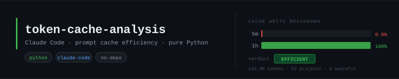

<div align="center">
  
</div>

<div align="center">

[](https://python.org)
[](https://github.com/slmingol/token-cache-analysis/blob/main/claude_cache.py)
[](https://github.com/slmingol/token-cache-analysis/blob/main/LICENSE)
[](https://github.com/slmingol/token-cache-analysis/commits/main)
[](https://github.com/slmingol/token-cache-analysis/stargazers)
[](https://claude.ai/code)

</div>

Scripts for analyzing Claude Code prompt cache usage across all local sessions.

## Configuration

Copy `.env.example` to `.env` and set your workspace dirs:

```bash
cp .env.example .env
```

```ini
# .env
CACHE_GROUPS=~/dev/projects:~/dev/work:~/side-projects
# SESSIONS_DIR=~/.claude/projects
```

`.env` is gitignored. CLI flags (`--groups`, `--sessions-dir`) override `.env` values.

## Background

Claude Code writes tokens to two cache tiers:

| Tier | TTL | Cost | Reuse |
|------|-----|------|-------|
| 5m ephemeral | 5 minutes | cheap | low — expires before next turn in slow sessions |
| 1h ephemeral | 1 hour | higher | high — survives across most session turns |

High 5m% = paying for cache that expires before it's reused. High 1h% = efficient.

---

## Scripts

### `claude_cache.py` — Daily totals

Scans all sessions, shows **daily** cache write breakdown.

```
python3 claude_cache.py
python3 claude_cache.py --sessions-dir /path/to/.claude/projects
python3 claude_cache.py --help
```

Example output:

```
claude_cache.py  [--sessions-dir DIR]  [--help]
Scanning /Users/you/.claude/projects ...

Date             5m cache     1h cache    Total writes     5m %
------------------------------------------------------------------------------
2026-05-30              0       80,581          80,581     0.0%
2026-06-10              0      162,790         162,790     0.0%
2026-09-13              0   18,847,991      18,847,991     0.0%
2026-09-14          4,576   85,119,570      85,124,146     0.0%
------------------------------------------------------------------------------
TOTAL               4,576  140,304,473     140,309,049     0.0%

Scanned 65 session files • Processed 12,847 turns with cache writes
```

---

### `claude_cache_by_project.py` — Per-project, split by workspace

Groups projects under `~/dev/projects` and `~/dev/bandwidth` separately. Rates each project EFFICIENT / MIXED / WASTEFUL based on 5m%.

```
python3 claude_cache_by_project.py
python3 claude_cache_by_project.py --groups ~/work ~/personal ~/side-projects
python3 claude_cache_by_project.py --sessions-dir /path/to/.claude/projects
python3 claude_cache_by_project.py --help
```

Thresholds:
- **EFFICIENT** — <30% 5m
- **MIXED** — 30–70% 5m
- **WASTEFUL** — >70% 5m

Example output (truncated):

```
claude_cache_by_project.py  [--groups DIR ...]  [--sessions-dir DIR]  [--help]

=========================================================================================================
  ~/dev/projects
=========================================================================================================
Project                                              5m           1h        Total     5m%  Verdict
---------------------------------------------------------------------------------------------------------
homelable                                             0   12,952,996   12,952,996    0.0%  EFFICIENT
homelab-network-redesign                              0   12,600,847   12,600,847    0.0%  EFFICIENT
pr-dashboard                                          0   12,327,769   12,327,769    0.0%  EFFICIENT
claude-def                                            0    8,215,053    8,215,053    0.0%  EFFICIENT
pfsense-cli                                           0    7,512,409    7,512,409    0.0%  EFFICIENT
...
---------------------------------------------------------------------------------------------------------
SUBTOTAL                                              0  103,863,577  103,863,577    0.0%

  Efficient: 40  Mixed: 0  Wasteful: 0  (40 total)

=========================================================================================================
  ~/dev/bandwidth
=========================================================================================================
Project                                              5m           1h        Total     5m%  Verdict
---------------------------------------------------------------------------------------------------------
openshift-audit-reports                               0    9,737,844    9,737,844    0.0%  EFFICIENT
datadog-cost-roller                                   0    9,155,815    9,155,815    0.0%  EFFICIENT
dedup-lm-dd-assets                                    0    6,116,482    6,116,482    0.0%  EFFICIENT
captagent                                         4,576      728,171      732,747    0.6%  EFFICIENT
...
---------------------------------------------------------------------------------------------------------
SUBTOTAL                                          4,576   36,401,448   36,406,024    0.0%

  Efficient: 12  Mixed: 0  Wasteful: 0  (12 total)
```

---

## Findings (as of 2026-09-14)

- **140.3M total cache write tokens** across 53 projects
- **~0% 5m usage** — essentially all cache lands in 1h tier
- Only blip: `captagent` — 4,576 5m tokens (0.6% of its total, negligible)
- No wasteful or mixed projects in either workspace
- Claude Code's harness defaults to 1h cache for system prompt context, which matches long session patterns well

No action needed. Scripts are useful for re-checking after major usage pattern changes (new hooks, large CLAUDE.md additions, agent workflows).
